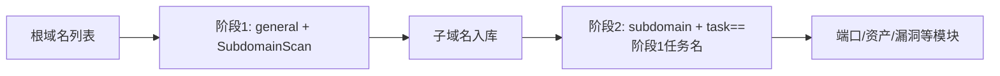

---

## name: scopesentry-mcp
description: 通过 ScopeSentry MCP 管理安全扫描平台（项目、任务、模板、资产、节点）。在用户提到 ScopeSentry、MCP、API Key、扫描任务、资产查询时使用。

# ScopeSentry MCP 使用指南

面向**已部署 ScopeSentry 实例**的用户。通过 Cursor（或其他 MCP 客户端）连接平台，无需本地源码。

## 1. 准备工作

### 1.1 确认服务可访问

- 默认 Web 界面：`http://<主机>`
- MCP 端点：`http://<主机>/mcp`（若前面有反向代理或前端代理，以实际 `/mcp` 地址为准）

### 1.2 创建 API Key

1. 浏览器登录 ScopeSentry Web 界面
2. 进入 **API Key** 管理页创建密钥（或通过管理员提供的接口创建）
3. 保存返回的 `ssk_...` 字符串（**仅显示一次**）

### 1.3 配置 Cursor MCP

Cursor → Settings → MCP → 添加服务器：

```json
{
  "mcpServers": {
    "scopesentry": {
      "url": "http://<你的主机>:8082/mcp",
      "headers": {
        "X-API-Key": "ssk_你的密钥"
      }
    }
  }
}
```

也可使用：`Authorization: Bearer ssk_你的密钥`

配置完成后重启 MCP 或重载 Cursor，确认工具列表中出现 `list_projects`、`list_assets` 等。

---

## 2. 工具一览


| 工具                     | 用途                |
| ---------------------- | ----------------- |
| `list_projects`        | 按标签分组的项目树（含项目 ID） |
| `list_projects_data`   | 分页项目列表，可按名称搜索     |
| `get_project`          | 项目详情              |
| `create_project`       | 新建项目              |
| `list_tasks`           | 扫描任务列表            |
| `get_task`             | 任务详情              |
| `list_scan_templates`  | 扫描模板列表            |
| `get_scan_template`    | 模板详情              |
| `list_plugin_modules`  | 扫描流水线模块名          |
| `list_plugins`         | 可用插件（含 hash、默认参数） |
| `create_scan_template` | 创建扫描模板            |
| `create_scan_task`     | 创建扫描任务            |
| `list_assets`          | 查询各类资产            |
| `get_asset_detail`     | 资产或漏洞详情           |
| `add_asset_tag`        | 为资产添加标签           |
| `list_nodes`           | 扫描节点列表            |


各工具参数以 MCP 工具描述（schema）为准；`list_assets` 的字段说明最完整，查询资产前可先阅读该工具 description。

---

## 3. 常用工作流

### 3.1 按项目查资产

当用户或上下文**已有项目条件**时，优先带上 `filter.project` 缩小范围，避免跨项目数据过多导致响应变慢。若无明确项目，可不强制加项目筛选。

1. `list_projects` 或 `list_projects_data` 获取目标项目的 **ObjectID**（`id` / `children[].value`）
2. `list_assets` 传入 `filter.project`（**必须是 ID，不能写项目中文名**）

```json
{
  "asset_type": "asset",
  "pageIndex": 1,
  "pageSize": 20,
  "search": "domain=^example.com",
  "filter": {
    "project": ["<项目ObjectID>"]
  }
}
```

### 3.2 创建扫描任务

1. `list_nodes` 获取在线节点名称
2. `list_scan_templates` 或 `create_scan_template` 获取模板 **ObjectID**
3. `create_scan_task`：`name`、`node` 必填，`template` 填模板 ID（不能填模板名）

**目标来源 `targetSource`（与 Web 端一致）：**

| targetSource | 说明 | 必填参数 |
| --- | --- | --- |
| `general` | 直接输入目标 | `target` |
| `project` | 从项目读取目标 | `project`（项目 ObjectID 数组） |
| `asset` | 从 Web 资产库搜索 | `search`；可选 `project`、`filter`、`targetNumber` |
| `RootDomain` | 从根域名库搜索 | `search`；可选 `project`、`filter`、`targetNumber` |
| `subdomain` | 从子域名库搜索 | `search`；可选 `project`、`filter`、`targetNumber` |
| `UrlScan` | 从 URL 扫描结果搜索 | `search`；可选 `project`、`filter`、`targetNumber` |
| `*Source`（如 `subdomainSource`） | 从资产页「选中/搜索」创建 | `targetTp=search` 时用 `search`；`targetTp=select` 时用 `targetIds` |

**示例 — 直接扫根域名：**

```json
{
  "name": "example-子域名收集",
  "node": ["node-1"],
  "template": "<模板ObjectID>",
  "targetSource": "general",
  "target": "example.com\nfoo.com",
  "project": ["<项目ObjectID>"]
}
```

**示例 — 从子域名库续扫（按上一任务名筛选）：**

```json
{
  "name": "example-端口与漏洞",
  "node": ["node-1"],
  "template": "<后续模块模板ObjectID>",
  "targetSource": "subdomain",
  "search": "task==\"example-子域名收集\"",
  "project": ["<项目ObjectID>"]
}
```

### 3.3 根域名完整信息收集（推荐两阶段）

当输入为**根域名**且要进行**完整信息收集**时，建议分两次扫描，不要一次跑全流水线。

**原因：** 分布式任务以**单个目标**为单位分发。根域名作为目标时，某节点分到该根域名后，在该节点上扫出的子域名也会继续在该节点执行后续模块，容易造成负载不均、速度慢、易出错。

**最佳实践：**

1. **第一阶段 — 仅子域名收集**
   - `targetSource`: `general`
   - `target`: 所有根域名（多行）
   - 模板：仅启用 `SubdomainScan`、`SubdomainSecurity`（子域名扫描 + 子域名接管）
   - 用 `get_task` 等待任务完成

2. **第二阶段 — 后续模块**
   - `targetSource`: `subdomain`
   - `search`: `task=="<第一阶段任务名称>"`（精确匹配任务名）
   - 可选 `project` 缩小范围
   - 模板：端口扫描、资产测绘、漏洞扫描等（可不含 SubdomainScan）
   - 子域名作为独立目标分发到各节点，并行效率更高

也可在 Web 界面「子域名」资产页按任务名筛选后，使用「从子域名创建任务」，效果相同。



### 3.4 创建扫描模板

1. `list_plugin_modules` → 模块名列表
2. `list_plugins`（可按 `module` 过滤）→ 各插件 `hash` 与默认 `parameter`
3. `create_scan_template`：用 `modules` 指定「模块 → 插件 hash 数组」

---

## 4. 资产查询（`list_assets`）

**性能建议：** 有项目条件时优先用 `filter.project` 缩小范围；`search` 中对已建索引字段尽量用 `==` 全等或 `^` 前缀匹配（见 [4.3](#43-search-搜索表达式)），避免大面积 `=` 模糊查询拖慢响应。无项目上下文时不强制加项目筛选。

支持 `filter.project` 的类型见 [4.4](#44-filter-精确过滤) 表格。

### 4.1 资产类型 `asset_type`

`asset`、`RootDomain`、`subdomain`、`app`、`mp`、`UrlScan`、`SensitiveResult`、`DirScanResult`、`crawler`、`vulnerability`、`PageMonitoring`、`IPAsset`、`SubdomainTakerResult`

别名示例：`web`→asset、`vuln`→vulnerability、`ip`→IPAsset、`url`→UrlScan

### 4.2 参数说明


| 参数                       | 说明                                      |
| ------------------------ | --------------------------------------- |
| `pageIndex` / `pageSize` | 分页，默认 1 / 20                            |
| `search`                 | 搜索表达式（见下节）                              |
| `filter`                 | 精确过滤 JSON（见下节）                          |
| `sort`                   | 仅 UrlScan、DirScanResult 支持按 `length` 排序 |
| `sid`                    | 仅 SensitiveResult：敏感规则名称                |


`search` 与 `filter` **可同时使用**。

### 4.3 search 搜索表达式

自定义 DSL（**不是 SQL**）：


| 运算符  | 含义   | 索引 | 示例                          |
| ---- | ---- | ---- | --------------------------- |
| `=`  | 模糊匹配（regex） | 不走索引 | `domain=example`            |
| `==` | 精确匹配（全等） | **走索引** | `port==443`                 |
| `!=` | 排除   | — | `port!="80"`                |
| `&&` | 与    | — | `domain==example.com && port==443` |
| `||` | 或    | — | `title=admin || body=login` |


**索引与运算符：** `domain`、`ip`、`port`、`title` 等字段已建索引，但仅 **`==` 全等** 或 **值以 `^` 开头的前缀匹配**（如 `domain=^example.com`）能走索引；**`=` 会转为 regex 模糊匹配，无法使用索引**，数据量大时易变慢。

**所有类型通用 search 字段：** `tag`、`task`（任务名称）、`rootDomain`

**project 不能写在 search 里**（无效或与 `&&` 组合时报错）。筛项目请用 `filter.project`。

**各类型常用 search 字段：**


| asset_type           | 字段                                                                                  |
| -------------------- | ----------------------------------------------------------------------------------- |
| asset                | domain, ip, port, service, app, title, statuscode, icon, banner, type, body, header |
| RootDomain           | domain, icp, company                                                                |
| subdomain            | domain, ip, type, value                                                             |
| app                  | name, icp, company, category, description, url, apk                                 |
| mp                   | name, icp, company, category, description, url                                      |
| UrlScan              | url, input, source, resultId, type                                                  |
| SensitiveResult      | url, sname, body, info, md5                                                         |
| DirScanResult        | url, statuscode, redirect, length                                                   |
| vulnerability        | url, vulname, matched, request, response, level                                     |
| crawler              | url, method, body, resultId                                                         |
| PageMonitoring       | url, hash, diff, response                                                           |
| IPAsset              | ip, domain, port, service, webServer, app                                           |
| SubdomainTakerResult | domain, value, type, response                                                       |


**search 示例：**

- `domain==www.example.com && port==443`（全等，走索引）
- `domain=^example.com`（前缀匹配，走索引）
- `ip==192.168.1.1`
- `task=="某任务名"`
- `level==high`（vulnerability）
- `statuscode==200`（DirScanResult）

需模糊包含时再用 `=`，如 `title=admin`（不走索引，宜配合项目等条件缩小范围）。

### 4.4 filter 精确过滤

JSON 对象：同 key 多个值为 **OR**，不同 key 为 **AND**。

**有项目条件时优先用 `project`：** 若用户或上下文已明确项目，且 asset_type 支持 `project`，应带上以缩小范围；无项目信息时不强制。


| filter key   | 含义       | 取值说明                                                     |
| ------------ | -------- | -------------------------------------------------------- |
| `project`    | 所属项目     | **ObjectID**，用 `list_projects` / `list_projects_data` 获取 |
| `task`       | 来源任务     | **任务名称**，用 `list_tasks` 的 `name`                         |
| `port`       | 端口       | 如 `"443"`                                                |
| `service`    | 服务/协议    | 如 `"https"`                                              |
| `app`        | 应用指纹     | 如 `"Nginx"`                                              |
| `icon`       | 图标 hash  |                                                          |
| `statuscode` | HTTP 状态码 | 主要用于 asset                                               |
| `status`     | 状态       | UrlScan/DirScan HTTP 码；漏洞/敏感信息处理状态                       |
| `level`      | 漏洞等级     | critical / high / medium / low / info                    |
| `type`       | 类型       | 如子域名记录类型 A、CNAME                                         |
| `color`      | 敏感规则颜色   | SensitiveResult                                          |
| `sname`      | 敏感规则名    | SensitiveResult                                          |
| `tags`       | 标签       |                                                          |


**各类型可用 filter key：**


| asset_type                            | filter key                                                      |
| ------------------------------------- | --------------------------------------------------------------- |
| asset                                 | project, port, service, app, icon, statuscode, type, task, tags |
| RootDomain                            | project, tags                                                   |
| subdomain                             | project, type, task, tags                                       |
| app / mp                              | project, tags                                                   |
| UrlScan                               | status, tags                                                    |
| DirScanResult                         | status, tags                                                    |
| SensitiveResult                       | status, color, sname, tags                                      |
| crawler                               | project, task, tags                                             |
| vulnerability                         | project, level, status, task, tags                              |
| PageMonitoring / SubdomainTakerResult | tags                                                            |
| IPAsset                               | project, port, service, app                                     |


**filter 示例：**

```json
{"project": ["<项目ObjectID>"], "port": ["443"]}
```

**组合查询示例：**

```json
{
  "asset_type": "asset",
  "search": "domain=^baidu && port==443",
  "filter": {"project": ["<项目ObjectID>"]},
  "pageIndex": 1,
  "pageSize": 10
}
```

**注意：**

- 有项目条件时优先带 `filter.project`（支持时）；无项目上下文可不强制
- `filter.project` 勿填项目显示名称
- 已知值用 `==`，前缀用 `^`；避免对大表滥用 `=` 模糊匹配
- UrlScan 的 HTTP 状态用 `filter.status`；DirScanResult 可在 search 中用 `statuscode==200`
- SensitiveResult 按规则名：`search` 用 `sname=规则名`，或 `filter.sname`

### 4.5 排序 sort

仅 **UrlScan**、**DirScanResult** 支持：

```json
{"length": "ascending"}
```

其他类型忽略 `sort`，按时间默认排序。

---

## 5. 扫描模板模块名

`TargetHandler`、`SubdomainScan`、`SubdomainSecurity`、`PortScanPreparation`、`PortScan`、`PortFingerprint`、`AssetMapping`、`AssetHandle`、`URLScan`、`WebCrawler`、`URLSecurity`、`DirScan`、`VulnerabilityScan`、`PassiveScan`

---

## 6. 故障排查


| 现象        | 处理                                                 |
| --------- | -------------------------------------------------- |
| MCP 无工具   | 检查 URL、API Key、ScopeSentry 是否运行                    |
| 401 / 403 | 重新创建或更换 API Key                                    |
| 资产查不到     | 确认 `filter.project` 为 ObjectID；勿在 search 写 project |
| 模板/任务创建失败 | `template` 必须是模板 ObjectID；`node` 填在线节点名            |
| 查询很慢/卡住   | 有项目时加 `filter.project`；search 对已索引字段改用 `==` 或 `^` 前缀，少用 `=`；缩小 `pageSize` |


---

